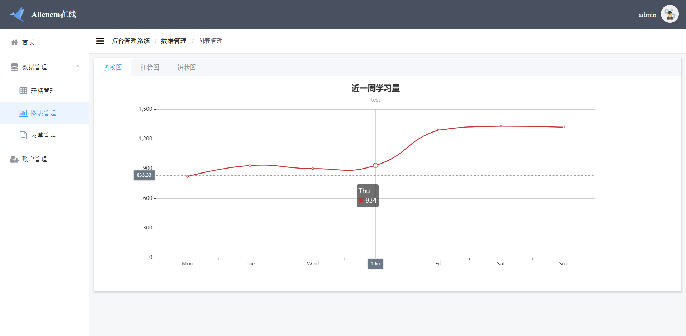

# vuets-app

## Quick Start

```bash
# Project setup
npm install

# Compiles and hot-reloads for development
npm run serve

# Compiles and minifies for production
npm run build

# Run your tests
npm run test

# Lints and fixes files
npm run lint
```

## Introduction


`src/shims-tsx.d.ts` Tell us that we can use JSX to code.

`src/shims-vue.d.ts` Help us import *.vue to *.ts

`assets` Store static source

`components/Charts.vue` Draw line,bar,pie charts

`store/` Use Vuex to store data

`utils/http.ts` Intercept requests & response

`views/` Some pages
- `404.vue` No Found
- `Home.vue` Home page
- `DataManage/` Show Data
  - `TableData.vue`
  - `EditDialog.vue`
  - `ChartsData.vue`
  - `FormData.vue`
- `Layout/` Layout
  - `Content.vue`
  - `Index.vue`
  - `LayoutHeader.vue`
  - `Sidebar.vue`
- `Login` Login & forget password
  - `Login.vue`
  - `LoginHeader.vue`
  - `Password.vue`
- `UserManage`

## Function

- [x] login & forget password page
- [x] home page
- [x] display, edit, delete, search, add table data 
- [x] display, edit, delete, add user data 
- [x] display 3 kinds of charts by using echarts
- [x] limit permission of vistor & editor

## Tree

```
.
│  .gitignore
│  babel.config.js
│  package-lock.json
│  package.json
│  README.md
│  tsconfig.json
│  vue.config.js
│
├─public
│  │  favicon.ico
│  │  index.html
│  │
│  └─css
│          reset.css
│
├─screenshort
│     ......
│
└─src
    │  App.vue
    │  main.ts
    │  router.ts
    │  shims-tsx.d.ts
    │  shims-vue.d.ts
    │
    ├─assets
    │  │  admin.jpg
    │  │  bg.jpg
    │  │  editor.jpg
    │  │  login-back.svg
    │  │  paperCraneBlue.png
    │  │  paperCraneRed.png
    │  │  visitor.jpg
    │  │
    │  └─404_images
    │          404.png
    │          404_cloud.png
    │
    ├─components
    │      Charts.vue
    │
    ├─store
    │      actions.ts
    │      getters.ts
    │      mutations.ts
    │      state.ts
    │      store.ts
    │
    ├─utils
    │      http.ts
    │
    └─views
        │  404.vue
        │  Home.vue
        │
        ├─DataManage
        │      ChartsData.vue
        │      EditDialog.vue
        │      FormData.vue
        │      TableData.vue
        │
        ├─Layout
        │      Content.vue
        │      Index.vue
        │      LayoutHeader.vue
        │      Sidebar.vue
        │
        ├─Login
        │      Login.vue
        │      LoginHeader.vue
        │      Password.vue
        │
        └─UserManage
                AccountData.vue
                AddAccount.vue
                UserInfo.vue
```


## Coding Procession

### Install Dependences
```bash
npm i element-ui -S
npm i axios @types/axios -S
npm i vuex-class -S
npm i jwt-decode @types/jwt-decode -S
cnpm i echarts @types/echarts -S
```

### Username & Password

admin 123456

### Some Good Websites

https://jwt.io/

https://echarts.baidu.com/

## Screenshort

Just show parts of them.

|||
|:-:|:-:|
|Login page|Forget password|

|||
|:-:|:-:|
|Home page|Table page|

|||
|:-:|:-:|
|table-edit|table-delete|

|||
|:-:|:-:|
|charts-line page|charts-bar page|

|||
|:-:|:-:|
|charts-pie page|form page|

|||
|:-:|:-:|
|userinfo page|users page|

|||
|:-:|:-:|
|user-edit page|user-delete page|
